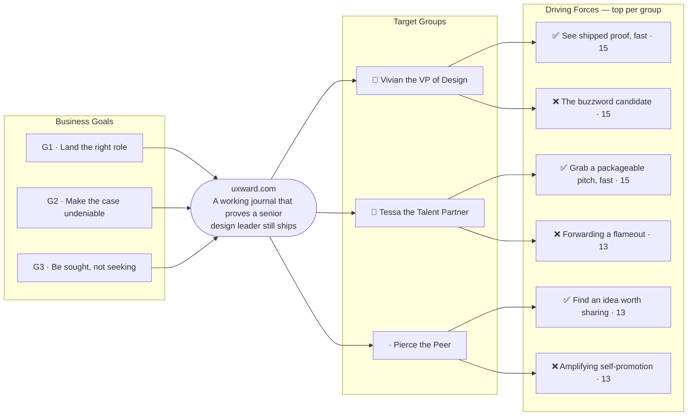

# Trigger Map — uxward.com

> Phase 2 — Trigger Mapping
> Source: Workshops 1–4, product-brief.md
> Status: Draft — pending review

---

## The Map

---

## Business Goals

| Goal | Vision | Key Objectives |
|------|--------|----------------|
| G1 | **Land the right role** | Senior leadership offer by mid-2027 · ≥3 final-round conversations by Q1 2027 · zero compromises on the non-negotiables |
| G2 | **Make the case undeniable** | 30-second test passes (5+ peer reviewers, Q3 2026) · hero + 4 supporting cases at launch · ≥40% of engaged sessions reach a case |
| G3 | **Be sought, not seeking** | 4 essays/year, ≥28 at launch · ≥6 qualified inbound conversations / 12 mo · #1 "Brandon Ward" result within 6 mo |

→ Full detail: [01-business-goals.md](01-business-goals.md)

---

## Target Groups

| Priority | Persona | Goals served | Persona page |
|----------|---------|--------------|--------------|
| 👥 Primary | **Vivian the VP of Design** — the design exec who owns the req | G1, G2, G3 | [02-persona-vivian-the-vp.md](02-persona-vivian-the-vp.md) |
| 👤 Secondary | **Tessa the Talent Partner** — the recruiter who forwards the link | G3, G1, G2 | [03-persona-tessa-the-talent-partner.md](03-persona-tessa-the-talent-partner.md) |
| · Tertiary | **Pierce the Peer** — the respected voice who vouches | G3, G2, G1 | [04-persona-pierce-the-peer.md](04-persona-pierce-the-peer.md) |

---

## Driving Forces — Priority Summary

Sorted by FIA score (Frequency + Intensity + Fit /15). Scores ≥ 13 are high-priority design inputs.

| Score | Force | Group | Direction |
|-------|-------|-------|-----------|
| **15** | See shipped proof, fast | Vivian | ✅ Positive |
| **15** | The buzzword candidate | Vivian | ❌ Negative |
| **15** | Grab a packageable pitch, fast | Tessa | ✅ Positive |
| **14** | Recognize a specific point of view | Vivian | ✅ Positive |
| **14** | The gone-soft leader | Vivian | ❌ Negative |
| **14** | Her time wasted | Vivian | ❌ Negative |
| **14** | Confirm fit before pitching | Tessa | ✅ Positive |
| **13** | See range across verticals | Vivian | ✅ Positive |
| **13** | Look smart to the hiring VP | Tessa | ✅ Positive |
| **13** | Forwarding a flameout | Tessa | ❌ Negative |
| **13** | The high-maintenance / unclear candidate | Tessa | ❌ Negative |
| **13** | Find an idea worth sharing | Pierce | ✅ Positive |
| **13** | Amplifying self-promotion | Pierce | ❌ Negative |
| **12** | Picture him in the room | Vivian | ✅ Positive |
| **12** | Can't verify the claims | Tessa | ❌ Negative |
| **12** | Respect the person behind it | Pierce | ✅ Positive |
| **12** | Vouch with confidence when asked | Pierce | ✅ Positive |
| **11** | Feel the social proof | Vivian | ✅ Positive |
| **11** | Grab ready-to-use assets | Tessa | ✅ Positive |
| **11** | Look discerning for noticing early | Pierce | ✅ Positive |
| **11** | Vouching for someone who'd embarrass him | Pierce | ❌ Negative |
| **10** | The blind-hire risk | Vivian | ❌ Negative |
| **10** | Shallow or derivative takes | Pierce | ❌ Negative |

**Key read:** Vivian owns the entire top tier — every force at 14–15 is hers, positive *and* negative in equal measure. That means the homepage has to do two opposing jobs in the same 30 seconds: **assert shipped proof and a clear point of view instantly**, while **ruthlessly avoiding the buzzwords, staleness, and friction that close the tab.** This is a *trust-by-disqualification* audience — you win as much by not tripping alarms as by impressing. The 13-tier then broadens the mandate: make the proof **verifiable and packageable** for Tessa (who repeats it secondhand) and **authentic and worth sharing** for Pierce (who stakes his own name on it). Negative forces run as hot as positive ones throughout — restraint and specificity aren't aesthetic choices here, they're conversion mechanics.

---

_Produced by Saga — 2026-06-08_
_Source: 01-business-goals.md, NN-persona-*.md_
